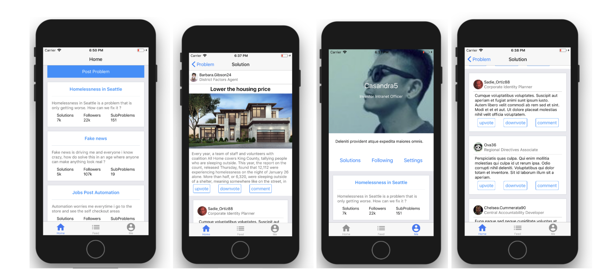
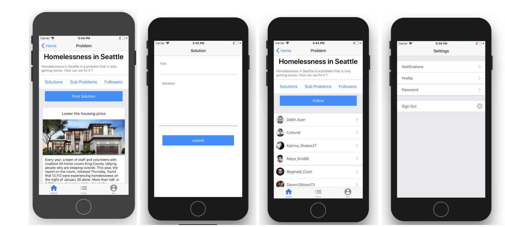

<h1 align="center""> Think Tank </h1>

Think tank is a mobile app for collaborating to solve world problems built with react native. Users can add a new "Problem" to the app and other users that are interested in the same problem can try to solve the problem by adding their "Solution". Solutions are upvoted and downvoted by the community as they try to find the best solution to fix the problem. 

#### Preview

To install Think Tank for development purposes :
1. `git clone https://github.com/khalidM3/Think-tank.git`
2. `npm install` or `yarn install`
3. make sure you have the appropriate environment for react native apps, if not [setup react native environment](https://facebook.github.io/react-native/docs/getting-started)
3. run `react-native run-ios` for ios or `react-native run-android` for android

### Fake API
The app is populated with fake data from `./src/fake-data` which acts like a fake api getting its values from [faker.js](https://www.npmjs.com/package/faker). The fake api has 4 models :
  1. User
  2. Problem
  3. Solution
  4. Comment

### To be continued ...
The next steps for this app will be to change the fake api to a real api, preferably a GraphQL api
